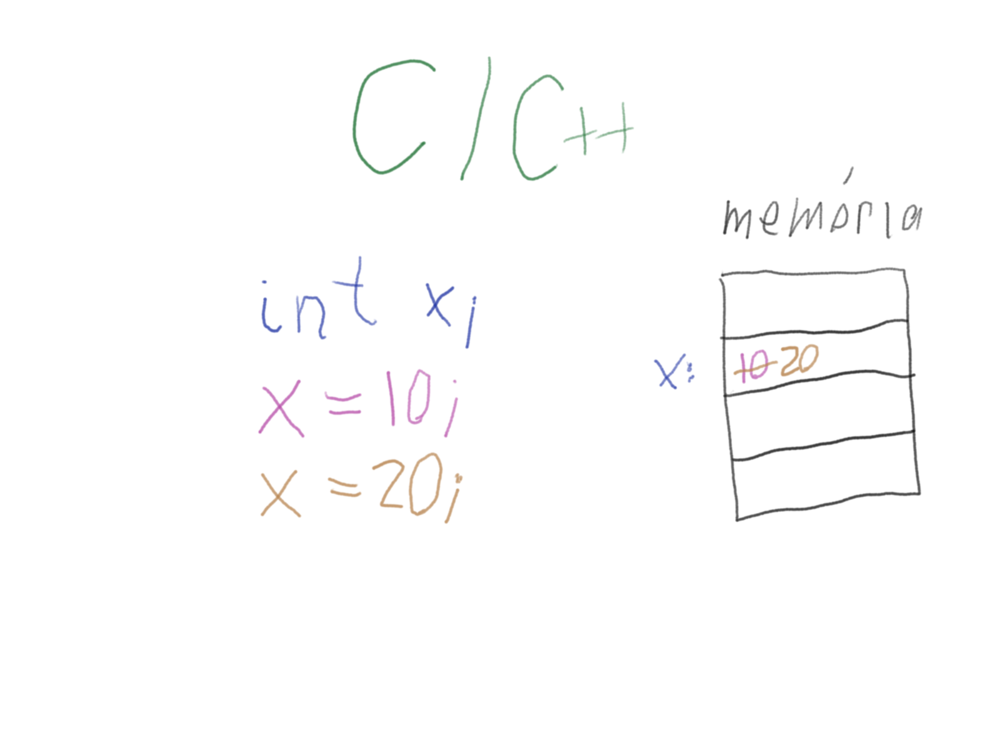

# Adattípusok

(2020. 11. 17.)

Mittelholcz Iván

---

## 1. Interaktív Python

```sh
python
```

- nem kell fájlt megadni
- gyorsan ki lehet próbálni egy ötletet
- az iypthon jobb (szintaxis, kiegészítés TAB-bal, indentálás)
  - telepítés: `pip install jupyter` (virtualenv-ben) vagy `pip install --user jupyter` (sima felhasználóként)
  - indítás: `ipython`
- előzmények: felfele/lefele nyíl
- kilépés: Ctrl+D

## 2. Adat és utasítás

```python
len('alma')
```

Dokumentáció:

- típusok: <https://docs.python.org/3/library/stdtypes.html>
- függvények: <https://docs.python.org/3/library/functions.html>

## 3. Változók és értékadás

Változó: címke egy memóriaterületen (pl. C/C++)



Változó: címke egy memóriában lévő objektumon (Python)


### Trükkös értékadások

```python
x = 10
x = y = 10
x, y = 10, 20
```

## 4. Miért van az adatoknak típusa?

```python
type(adat)
```

- memóriaigény
- műveletek

### Függvények

```py
x = 10
s = 'alma'

print(x)
print(s)

len(x)
len(s)
```

### Metódusok és műveletek

```py
x + 20
x + 'alma'

s.upper()
x.upper()

x.__add__(20)
```

## 5. Egyszerű adattípusok

### Igazságérték (*boolean*)

- lehetséges értékek: `True` vagy`False`
- műveletek: `and`, `or`, `not`
- kapcsolódó függvények: `bool()`

### Egész számok (*integer*)

- lehetséges értékek: ~
- műveletek: `+`, `-`, `*`, `/`, `//`, `%`, `**`, `<`, `<=` `>`, `>=`, `==`, `!=`
- kapcsolódó függvények: `int()`, `bin()`, `oct()`, `hex()`

### Lebegőpontos számok (*float*)

- lehetséges értékek: tizedestörtek
- műveletek: `+`, `-`, `*`, `/`, `//`, `%`, `**`, `<`, `<=` `>`, `>=`, `==`, `!=`
- kapcsolódó függvények: `float()`, `round()`
